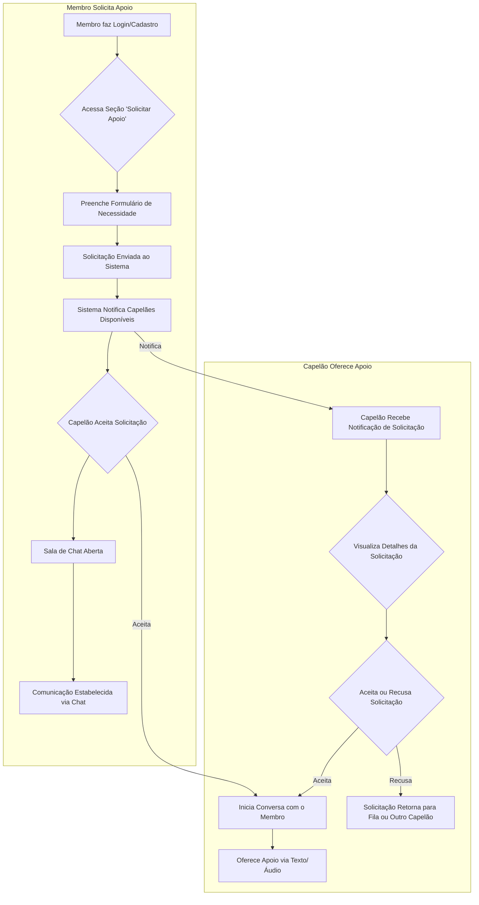

```mermaid
flowchart TD
    subgraph Membro Solicita Apoio
        A[Membro faz Login/Cadastro] --> B{Acessa Seção 'Solicitar Apoio'}
        B --> C[Preenche Formulário de Necessidade]
        C --> D[Solicitação Enviada ao Sistema]
        D --> E[Sistema Notifica Capelães Disponíveis]
        E --> F{Capelão Aceita Solicitação}
        F --> G[Sala de Chat Aberta]
        G --> H[Comunicação Estabelecida via Chat]
    end

    subgraph Capelão Oferece Apoio
        I[Capelão Recebe Notificação de Solicitação] --> J{Visualiza Detalhes da Solicitação}
        J --> K{Aceita ou Recusa Solicitação}
        K -- Aceita --> L[Inicia Conversa com o Membro]
        K -- Recusa --> M[Solicitação Retorna para Fila ou Outro Capelão]
        L --> N[Oferece Apoio via Texto/Áudio]
    end

    E -- Notifica --> I
    F -- Aceita --> L
```

